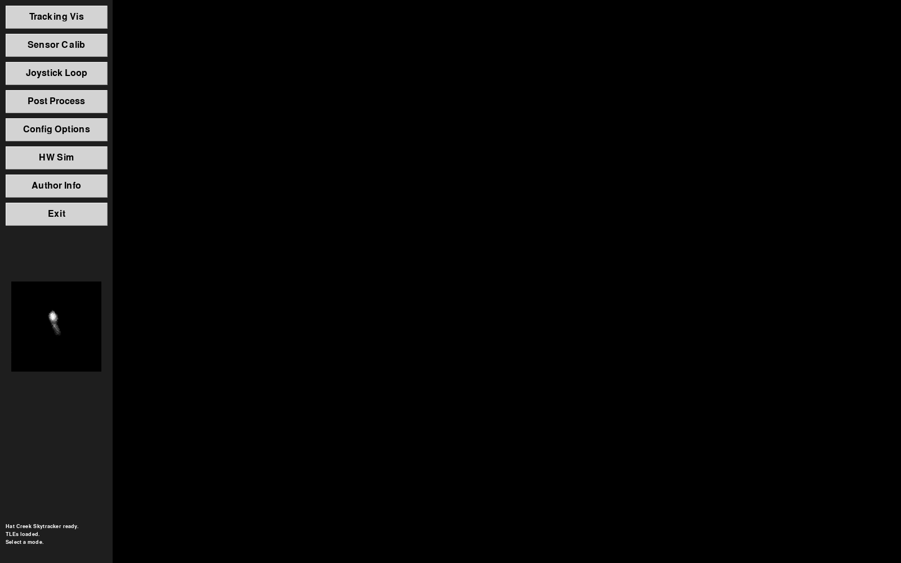
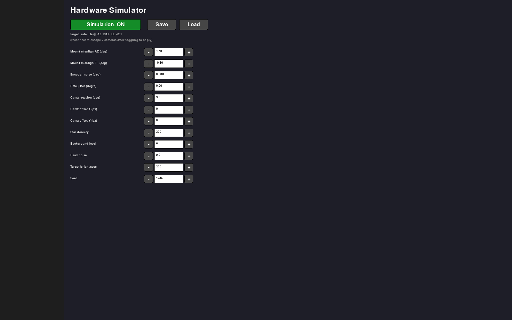
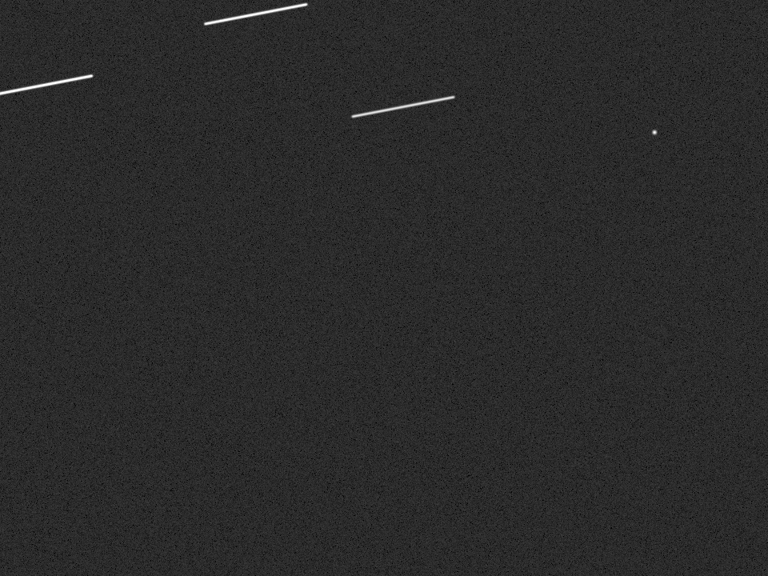
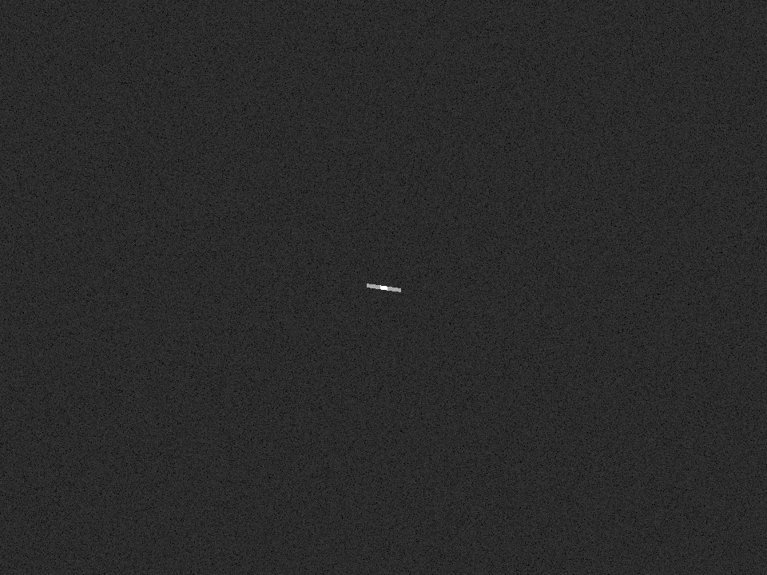
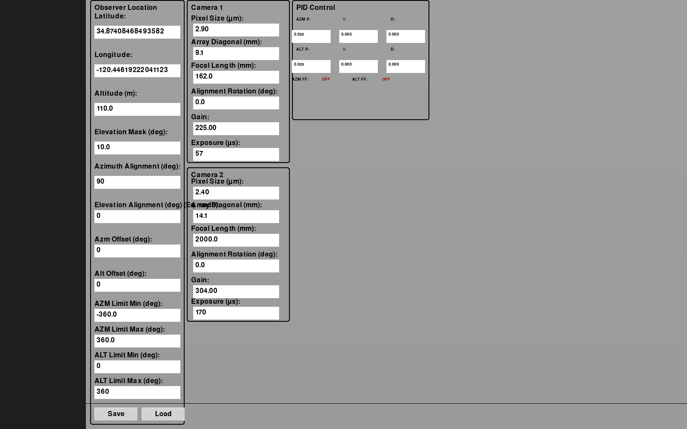

# Hat Creek Skytracker

An optical tracker for select telescopes — a single-operator application for
finding, acquiring, tracking, and collecting imagery of space and airborne
objects (satellites, rockets, aircraft) from stationary or mobile platforms.

It pairs a Celestron NexStar mount with one or two cameras (a wide "finder/guide"
camera and a narrow long-focal-length camera) and provides a fast, game-like UI
with selectable tracking modes, real-time closed-loop control, and labeled data
capture.



## Current Capabilities

**Tracking modes** (cycle through them from the Joystick Loop):
- **STANDBY** — poll/display mount position only.
- **RATE_CONTROL** — manual joystick slewing with hardware safety limits.
- **PROGRAM** — automatically follow a TLE satellite pass or an imported launch
  trajectory, using interpolated angular position + rates.
- **HOTSPOT** — closed-loop *optical* tracker: detect the brightest ("hot")
  object in the camera frame and drive the mount to keep it centered. Intended
  as an operator hand-off once PROGRAM track has the object in frame (rockets,
  aircraft). Coasts briefly on a dropout, then falls back to PROGRAM.
- **HANDOFF / MTI** — reserved for future work (e.g. dim satellites amid
  streaking stars, which need a different detection approach than HOTSPOT).

**Real-time control architecture**
- A dedicated **mount control thread** runs the read → PID → command cycle at a
  fixed cadence, fully decoupled from the pygame render loop, so rendering jitter
  and blocking serial I/O can't stall mount commands.
- **Hardened serial layer**: every NexStar AUX transaction is locked and uses a
  short timeout; a missing/short response is reported and the cycle is skipped
  instead of freezing the loop (which previously let an axis run open-loop).
- **PID controller** with trajectory **feed-forward**, **derivative-on-measurement**
  (no derivative kick), and **conditional-integration anti-windup**.

**Imaging & visualization**
- Threaded camera capture (ZWO ASI) with a large circular buffer and
  microsecond-precision UTC timestamps; labeled `.png` + per-frame metadata capture.
- Real-time annotated polar sky plot, satellite pass tables, and camera FOV
  overlays. Render threads publish complete, double-buffered frames (no flicker).

**Hardware simulator** (see below) — run the entire tracking loop without any
physical hardware present.

## Hardware Interfaces

- **Celestron NexStar AUX** (primary; implemented in `lib/auxstar.py`)
- **Meade LX200 classic** (legacy interface)

## Technologies

- **Python 3.11** (conda environment `track`)
- **pygame** — UI, input, and rendering
- **NumPy / SciPy** — control math, detection, geometry
- **OpenCV** — image handling
- **Skyfield / sgp4** — TLE propagation and astrometry
- **pandas** — pass/data tables
- **pyserial** — NexStar AUX serial protocol
- **zwoasi** — ZWO ASI camera SDK bindings
- **plotly** — post-processing/plots

## Hardware Simulator

To hone the user experience and develop the control/acquisition algorithms
without the bulky hardware, the app includes software simulators for the mount
and both cameras. Enable it from the **HW Sim** screen (off by default — when
off, real-hardware behavior is unchanged):



- **Sim mount** integrates the same rate commands the control loop issues into a
  true pointing, and reports an encoder position with injectable **initial
  misalignment** and **noise** — so offset calibration and the closed loop have
  something real to fight.
- **Sim cameras** render synthetic imagery of whatever is being tracked, given
  the mount's true pointing and the camera geometry, with injectable
  **inter-camera rotation + image-plane misalignment** (what co-boresight
  calibration is meant to solve). Frames flow through the *same* capture pipeline
  the real cameras use.
- A **launch** renders as a hot plume; a **live-TLE satellite** renders as a small
  dot in the wide cam and a rough **Starlink V2 Mini** in the narrow cam, over a
  **star field that streaks** with mount motion.

| Wide / guide cam (satellite dot among streaking stars) | Narrow cam (Starlink V2 Mini) |
| --- | --- |
|  |  |

The simulator closes the loop entirely in software: sim mount pointing → sim
camera render → hot-spot detection → PID → rate command → sim mount moves. This
makes it possible to demonstrate a full hand-off-and-track sequence at a desk.

## Configuration

Site, optics, PID gains, safety limits, hot-spot, and simulator parameters live
in `config.json` and are editable from the **Config Options** and **HW Sim**
screens.



## Testing

The control/detection/simulation logic is covered by headless unit tests (run
under the `track` env), including a sim-in-the-loop test that asserts the hot-spot
loop drives a simulated object to frame center:

```
python test_serial_transact.py        # serial transaction layer (lock, timeouts)
python test_pid_control.py             # PID: feed-forward units, anti-windup, derivative
python test_render_buffer.py           # render double-buffering (no flicker)
python test_hotspot.py                 # hot-spot detection + pixel->angle geometry
python test_hotspot_integration.py     # HOTSPOT acquire / coast / fallback
python test_simulator.py               # sim mount dynamics, geometry, sim-in-the-loop
python test_hw_sim_ui.py               # HW Sim panel logic
```

## Project Goals & Roadmap

The longer-term vision is one set of cooperating, automation-friendly tools that
make running an optical pass fun and fast — so even a child could run it — rather
than alt-tabbing between many GUI programs.

- **Visibility & pass setup** — rich, annotated live sky plots; extract relevant
  facts for a known opportunity; overlay optical-system capability; ingest a PVT
  ephemeris + covariance to augment TLE; annotate TLE-vs-ephemeris differences.
- **Sensor-to-mount calibration** — guided two-sensor co-boresight against a
  guide star; solve sensor rotations and step calibrations into config.
- **Joystick loop** — manual track, program track, moving-object search,
  acquisition, tracked-object handoff, click-in-image selection, and labeled
  capture (UTC, mount az/el, rate, centroid per frame).
- **Post-processing** — quick-look and product generation to get a good shot
  posted fast.

We deliberately don't try to re-create everything existing tools (Heavens-Above,
SkyTrack, KStars, etc.) already do well — the focus is the niche capabilities
that go beyond them.

## License

See [LICENSE](LICENSE).
