# Hat Creek Skytracker

An optical tracker for select telescopes — a single-operator application for
finding, acquiring, tracking, and collecting imagery of space and airborne
objects (satellites, rockets, aircraft) from stationary or mobile platforms.

It pairs a Celestron NexStar mount with one or two cameras (a wide "finder/guide"
camera and a narrow long-focal-length camera) and provides a fast, game-like UI
with selectable tracking modes, real-time closed-loop control, and labeled data
capture.

Pass predictions are cross-validated against heavens-above.com to the
seconds level across orbit classes — see [`VALIDATION.md`](VALIDATION.md).

New to all this? Every screen has **explanatory hover tooltips** — hover any
pane, button, or toggle for a plain-English description of what it does
(visible in the Joystick Loop screenshot below). The **Tips** chip in the
bottom-right corner turns them off once you know your way around.


## Current Capabilities

**Tracking modes** (cycle through them from the Joystick Loop):
- **STANDBY** — poll/display mount position only.
- **RATE_CONTROL** — manual joystick slewing with hardware safety limits,
  through an **adaptive speed gearbox**: full stick deflection is capped at a
  gentle base rate (~0.5°/s) so a slammed stick can't fling the target out of
  frame; holding the stick pinned deliberately winds the ceiling up toward the
  mount's full 10°/s, and backing off, releasing, or reversing direction winds
  it back down. A segmented **Slew speed** indicator beside the stick display
  shows the current gear. Kid-tested design goal: you have to *earn* the fast
  rates, and letting go always lands you back in gentle mode.
- **PROGRAM** — automatically follow a TLE satellite pass, an imported launch
  trajectory, a tracked ADS-B aircraft, **or any celestial object** — sun,
  moon, planets (Pluto included, because every kid asks), the 100 brightest
  named stars, and the Messier/NGC deep-sky catalogues — using interpolated
  angular position + rates. Celestial targets ride a sliding 90-minute
  Skyfield-apparent trajectory window that refreshes automatically, so the
  mount slews to the object and then follows it across the sky indefinitely.
  Selecting the sun posts a loud solar-filter warning.
- **HOTSPOT** — closed-loop *optical* tracker: detect the brightest ("hot")
  object in the camera frame and drive the mount to keep it centered. Intended
  as an operator hand-off once PROGRAM track has the object in frame (rockets,
  aircraft). Coasts briefly on a dropout, then falls back to PROGRAM.
- **HANDOFF / MTI** — reserved for future work (e.g. dim satellites amid
  streaking stars, which need a different detection approach than HOTSPOT).

**Real-time control architecture**
- A dedicated **mount control thread** runs the read → PID → command cycle at a
  fixed cadence, fully decoupled from the pygame render loop, so rendering jitter
  and blocking serial I/O can't stall mount commands.
- **Hardened serial layer**: every NexStar AUX transaction is locked and uses a
  short timeout; a missing/short response is reported and the cycle is skipped
  instead of freezing the loop (which previously let an axis run open-loop).
- **PID controller** with trajectory **feed-forward**, **derivative-on-measurement**
  (no derivative kick), and **conditional-integration anti-windup**.
- **One-click PID auto-tune** (`autotune.py`): while tracking in PROGRAM or
  HOTSPOT, the PID pane's **AUTOTUNE** button runs an online coordinate-descent
  optimizer over all six gains — no injected test signals, just the live
  tracking error. It probes each gain up/down in log space, keeps measured
  improvements, converges in a few minutes (the sliders visibly follow along),
  and pauses safely on STOP or a lost target. Stopping keeps the best gains
  found; works identically under the Python and Rust control loops.
- **Per-mode gain profiles**: PROGRAM (encoder loop) and HOTSPOT (optical loop)
  are different plants, so each keeps its own gain set in
  `config.pid_mode_profiles` — swapped into the live gains **automatically** on
  mode transitions (HANDOFF shares PROGRAM's). Each profile is stamped with the
  **target it was tuned on** and the date, shown in the PID pane, so you know
  whose tune you're flying.

**Imaging & visualization**
- Threaded camera capture (ZWO ASI) with a large circular buffer and
  microsecond-precision UTC timestamps; labeled `.png` + per-frame metadata capture.
- Real-time annotated polar sky plot, satellite pass tables, and camera FOV
  overlays. Render threads publish complete, double-buffered frames (no flicker).
- A KSP-style **navball** shows live mount attitude with the target's trajectory,
  a target crosshair, and ADS-B aircraft markers overlaid.
- **ADS-B aircraft tracking** (RTL-SDR / Nooelec): nearby aircraft appear on the
  skyplot and navball and can be selected, slewed to, and tracked like a satellite.

**Rendering performance.** The render threads invariant-cache their expensive
per-frame work so they don't starve the GIL the camera capture threads need:
the navball's hemisphere/grid is cached on quantized pointing, each processed
camera feed is cached on its capture sequence, and the skyplot's static
background (grid/labels/keepout), starfield, and selected-satellite arc are
cached layers rebuilt on a seconds-scale quantum instead of drawn per frame
(~14× cheaper). Camera frames are buffered into the capture ring **only while
a capture is armed** — idle memory stays flat instead of accumulating up to
1000 full-resolution frames per camera. See [`LEARNINGS.md`](LEARNINGS.md).

**Hardware simulator** (see below) — run the entire tracking loop without any
physical hardware present.

## Screens

**Tracking Vis** — annotated polar sky plot with the selected object's orbit,
orbital elements, camera FOV footprints, and a scrollable pass table sortable
on every column (click a header; shift-click stacks multi-column sorts) —
including **apogee altitude** and an **estimated visual magnitude** computed
from range + solar phase geometry, with `ecl` marking passes that sit in
Earth's shadow at culmination. In the shot below the table is sorted by
magnitude: the high-LEO OneWeb/Globalstar constellations are correctly the
only satellites still sunlit near local midnight.

The plot carries a full **celestial layer**: the sun, moon and planets are
always drawn (dimmed on the horizon rim when below it, so you can see where
they'll rise), the **100 brightest stars** get gold spike markers and their
IAU proper names (Sirius, Vega, Betelgeuse...), and the **Messier** and
**NGC** catalogues overlay as violet squares / teal circles (NGC additionally
magnitude-limited) to keep the noise manageable. A **Show objects** toggle
column on the left panel switches each object type on/off — satellites, their
labels, aircraft, stars, Messier, NGC — with the sun/moon/planets and named
stars deliberately always-on. Every object — plus every satellite and
aircraft — is click-selectable, and PROGRAM mode will slew to and track it.
Shown here with the live satellite catalogue (green = LEO, orange hexagon =
MEO, purple triangle = GEO) and a **rocket launch trajectory** climbing out
from the southwest horizon (cyan marker = the rocket now):

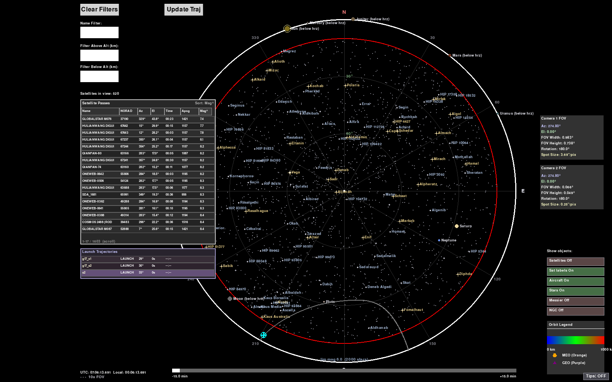

Both polar plots shade the **mount keepout** in light red: every sky direction
whose mount-axis solutions all fall outside the configured safety limits,
computed through the active mount mode's command transform (including the
over-the-zenith flip the tracking loop may use in AltAz) — so you can see at a
glance which targets and passes are flyable before picking one. Shown here
with an azimuth keepout wedge around north and a mount-ALT ceiling that
forbids the lowest elevations:

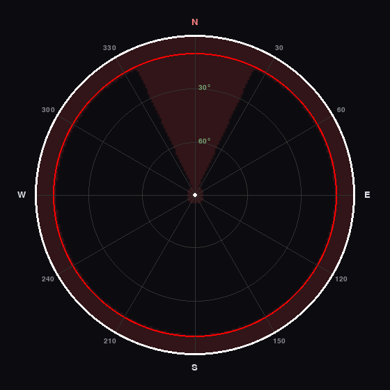

**Joystick Loop** — the operational screen: live camera feeds (with boresight
crosshairs), a polar-plot quadrant, an attitude navball, tracking-rate/error
strip charts, mount connection/position status, tracking mode, and PID
diagnostics. The PID pane's log sliders tune the gains live, and its
**AUTOTUNE** button hands them to the online auto-tuner while tracking. The
**Slew speed** gear bar next to the stick displays shows the adaptive
RATE_CONTROL ceiling (green = base range, orange = boost gears earned by
pinning the stick). The skyplot quadrant carries the same celestial layer and
click-selection as the full-screen plot, with **M** and **NGC** catalogue
toggles in the Targets strip. Shown here in simulation with the mount and
both cameras connected — note the hover tooltip explaining the PID Gains
pane, one of the explanations available on every control.

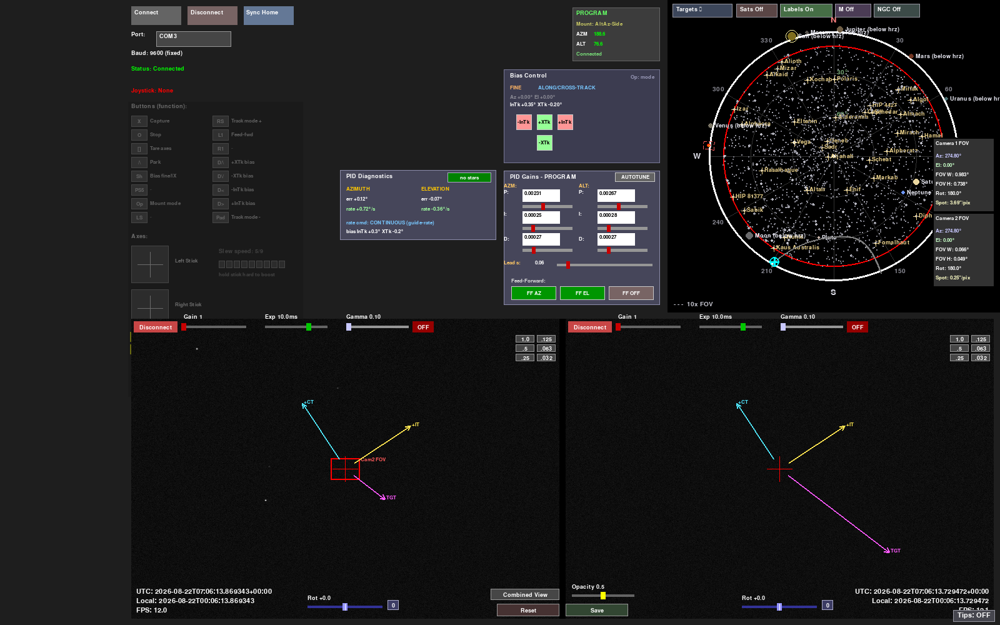

**Sensor Calibration** — both camera feeds side by side with gain / exposure /
alignment-rotation / ROI controls for co-boresighting the guide and main cameras.
The **Swap Cams 1&lt;-&gt;2** button (lower left) exchanges which physical camera
backs each pane — USB enumeration order can flip between boots, so when the
feeds come up swapped, one click reconnects them the right way around while
per-slot settings (gain / exposure / gamma / rotation) stay put.

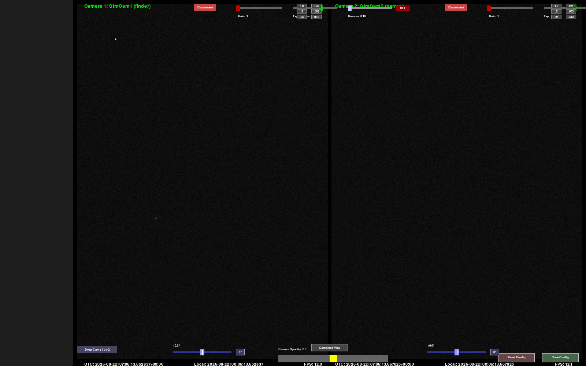

**Post Processing** — review and turn saved capture runs into products. A run
**library** (grouped by target, with favorites / tags / notes / rename /
delete) feeds a synced **side-by-side replay** of both cameras: scrub +
transport with in/out clip markers, per-pane gamma / brightness / contrast,
ASTAP-style **stabilization** against a chosen reference frame, in/cross-track
overlay vectors, and text / arrow / box **annotations** saved with the run.
**Drag a box on a pane to zoom** — zooms nest, deeper zooms re-decode at
higher resolution, and a right-click (or Reset zoom) restores the full frame.
Arming **Crop exp** makes every MP4 export crop to the zoomed region at native
resolution (the exact output pixel size is shown before you commit). Export
buttons write clips, stabilized movies, or the whole run to MP4; the
**lucky-imaging stack** buttons grade frames by sharpness, keep the best
25/50%, align them (optionally with alignment-point local warping or
PIPP-style target centring) and average them into a 16-bit linear master plus
a sharpened, share-ready final PNG. Shown here with Cam1 zoomed 2.5× on the
target and export-crop armed:

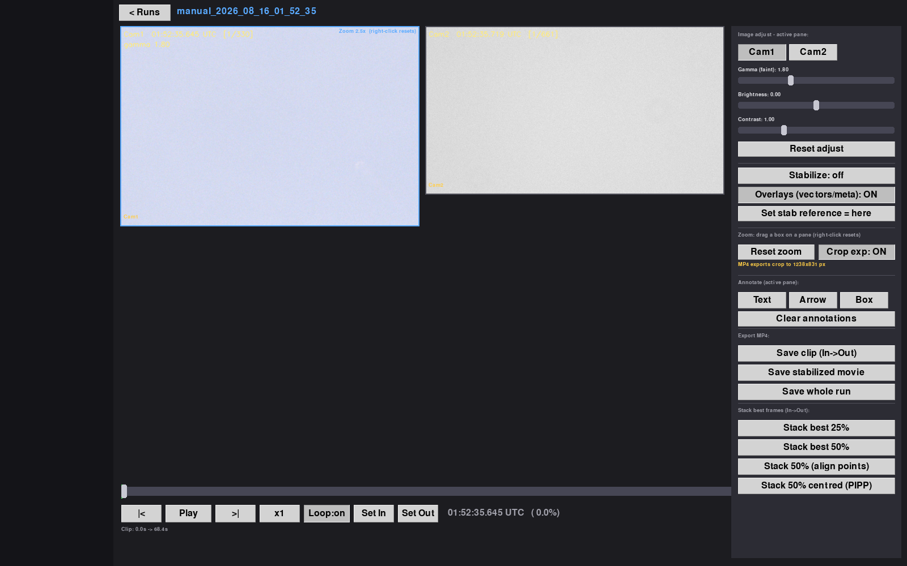

**Mount 3D** — a software-3D view of the mount for building alignment
intuition: the articulated single-fork-arm model (tripod → AZ-axis tube →
ALT-axis arm → side-mounted OTA, each rigidly attached like the real
hardware) poses from the live axis angles through the
**same forward transforms the tracker uses** (pinned by a parity test suite),
per mount mode — shown here in AltAz-Side, where the cyan AZM-axis arrow lies
on the horizon at the alignment azimuth. Both cameras' FOV cones sweep a real
star field with satellites, aircraft, the sun/moon/planets and the
Messier/NGC overlays, the selected trajectory, and the mount keepout tinted
on the sky dome — with the same object-type toggle buttons as the skyplot in
its HUD (the two views share one set of config flags). Two view cameras: free **orbit** (drag/wheel)
and an **operator view** rendered from your configured seat position (bearing
/ distance / eye height) so the perspective matches what you actually see.
Manual AZM/ALT sliders pose the model while disconnected. The orbit camera
dives the full ±89° — below the ground plane you look straight up through
the translucent ground at the mount and the whole sky dome. The star field
advances in real time with the tracking clock (sidereal rotation, pinned by
a regression test).

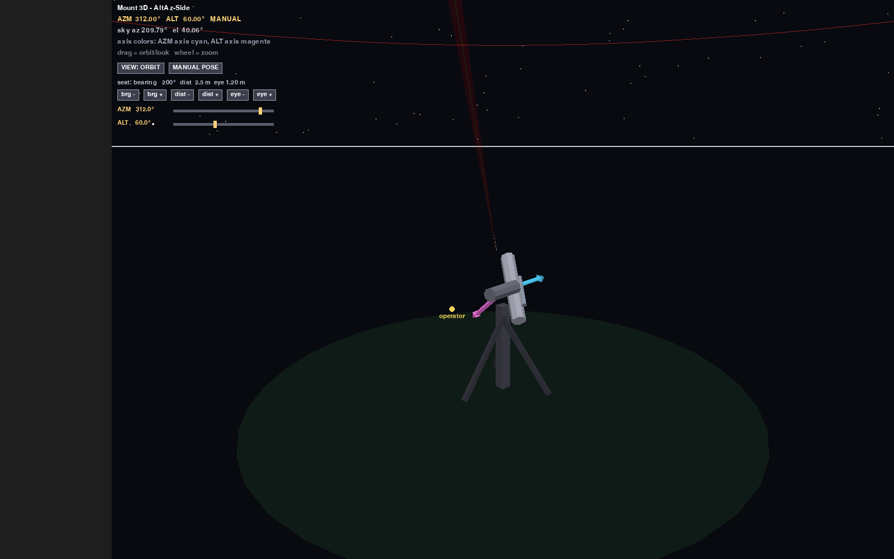

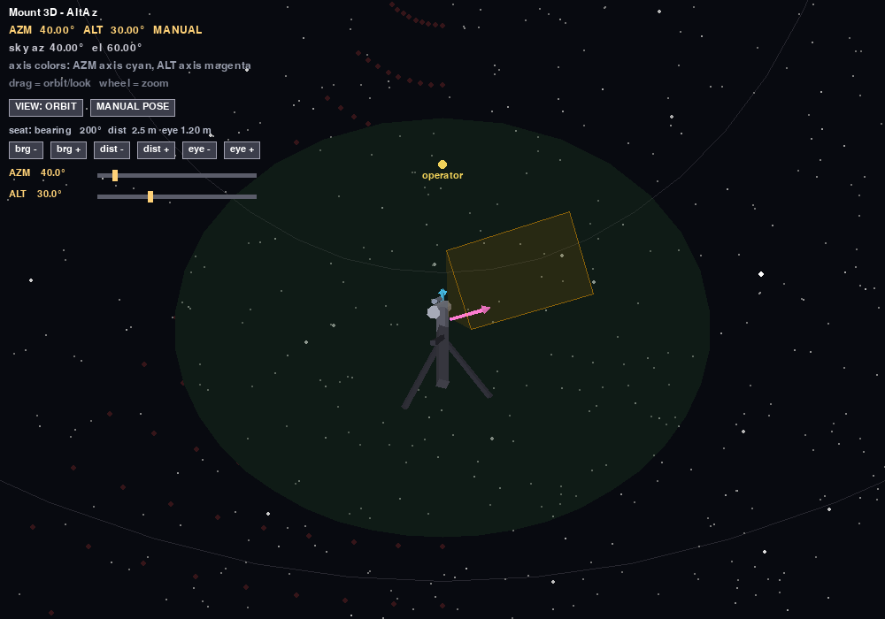

## Hardware Interfaces

- **Celestron NexStar AUX** (primary; implemented in `lib/auxstar.py`)
- **Meade LX200 classic** (legacy interface)

## Technologies

- **Python 3.11** (conda environment `track`)
- **pygame** — UI, input, and rendering
- **NumPy / SciPy** — control math, detection, geometry
- **OpenCV** — image handling
- **Skyfield / sgp4** — TLE propagation and astrometry
- **pandas** — pass/data tables
- **pyserial** — NexStar AUX serial protocol
- **zwoasi** — ZWO ASI camera SDK bindings
- **plotly** — post-processing/plots
- **Rust** (`rust/` Cargo workspace) — the real-time core (control loop, PID,
  hotspot detection, transforms, NexStar protocol) as the `skytracker_core`
  extension module, flag-gated via `use_rust_core_loop`

### Rust port (branch `rust-port`)

The project is being ported to Rust in phases — engines first, an egui+wgpu
UI last — with the pygame app staying fully functional after every phase.
`rust/` is a Cargo workspace: `skytracker-core` (control loop and friends),
`skytracker-astro` (the skyfield replacement: SGP4 passes, DE421 bodies,
star apparent places — sub-arcsec parity, bulk precompute 76× faster), and
`skytracker-ffi` (the only PyO3 crate; the Python module name stays
`skytracker_core`). The astro engine is flag-gated via `use_rust_astro`
(or `SKYTRACKER_RUST_ASTRO=1`), with skyfield as the automatic fallback.
Every phase is gated on golden-vector parity tests recorded from the
current Python implementations (`tools/record_golden.py` →
`tests/golden/`, committed), live A/B suites (`test_rust_astro_parity.py`),
the full pytest suite, and a closed-loop sim-tracking baseline
(`tests/golden/loop_baseline.json`). See `rust/README.md` for crate layout
and `VALIDATION.md` for the parity record.

#### Native app (Phase 7b — all screens)

`rust/skytracker-app` is the egui+wgpu application over the Rust engines —
seven screens rendered from worker snapshots at a 120 Hz repaint target
(display-refresh bound), every interaction a command on a channel:

| Screen | What it does |
|---|---|
| **Track** | Polar skyplot (Hipparcos stars with IAU proper names, the gated satellite set dead-reckoned between 2 Hz snapshots, sun/moon/planets, Messier + NGC overlays, ADS-B aircraft with predicted tracks, the mount keepout wash, mask ring, the selected satellite's ±10 min track with minute ticks, mount boresight + camera FOV + PROGRAM setpoint vector, hover cards, de-conflicted labels — every object click-selectable and PROGRAM-trackable), live camera with tracking overlay (reticle, HOTSPOT gate/centroid/SNR, REC tag), the mount instrument panel (STANDBY/RATE/PROGRAM/HANDOFF/HOTSPOT/STOP, az/el readouts, errors, gains, autotune, log), capture arm/save, and the sortable visible-now table. Rocket launch trajectories from `launches/` (cyan arcs, the rocket's live position, countdown before T0, selectable + trackable). Gamepad mirrors the Python map: Circle = STOP, R3/L3 = cycle mode, L1 = feed-forward toggle, Cross = capture arm/save, Triangle = park (configured offsets), D-pad = operator bias (cross-el / el; Share toggles 0.1° / 0.01° steps). `pid_mode_profiles` gains switch with the mode |
| **Cameras** | The sensor-calibration view for **three cameras** (guide 50 mm scope, ASI432MM on the main scope, ASI462MM hemispheric bubble cam — fisheye, fixed at the zenith): live feeds with per-camera **connect, gain, integration time, gamma stretch (+ enable), alignment rotation, ROI size + click-to-centre**, swap (exchanges the hardware index behind two logical slots, settings stay with the slot), arm/save runs across all cameras, reset / save to config; the **combined view** overlays the chosen feeds opacity-blended with rotation applied, optionally scaled to a common plate scale for co-boresighting; **filter wheel** cards for the ASI EFW on the main scope (goto slot, live position via EFW_filter.dll) and the manual wheel on the guide scope (mark position), with editable, persisted filter assignments |
| **Passes** | Upcoming passes over the next 6 h from the Rust pass predictor (AOS/TCA/LOS, peak el @ az, duration, peak rate, range, apogee, estimated magnitude / `ecl`), sortable on every column, LEO/GEO filters, name/NORAD filter, click-to-select |
| **Align** | Live camera with centroid/match overlay, one-click tetra3 plate solve (RA/Dec/roll/FOV/rmse → true az/el and pointing error vs the mount), 0.05° paddles, and the pointing-model alignment run (Fibonacci grid + holdout, spiral grid search, supervised confirm, 7-term fit with residuals) |
| **Replay** | Run library over `data/` (Python and native captures alike), synchronized two-camera replay with scrubber/speed, gamma / brightness / contrast, flow stabilization, sharpening, stack-N, in-track/cross-track overlays, annotations, H.264 MP4 export — all on worker threads |
| **Mount 3D** | Orbit-camera 3D view of the mount (AltAz / AltAz-Side / Passthrough / Eq kinematics), boresight ray, target ray + great-circle arc when tracking, FOV cone, soft-limit arcs |
| **Sim** | Live hardware-simulator controls: injected misalignment / periodic error, camera background / noise / target brightness / Tycho star limit |
| **Config** | Editor for the native app's config.json surface (site, mount + transport + serial port, control gains, hotspot/handoff, both cameras, sources & paths) — round-trips unknown keys, applies gains + hotspot signs live |

The Track screen has four selectable layouts (persisted as `track_layout`):
**tabs** (camera tabs in the control column), **stack** (all three cameras in
their own column), **quad** (controls | skyplot on top, 2 or 3 cameras across
the bottom — the classic Python arrangement), and **scope** (guide + main
split or weighted-combined dominate the screen; skyplot, bubble cam and the
essential mount controls go peripheral — with draggable splitters between
the right-bar sections). Exposure controls are logarithmic from **1 µs to
2 s** (µs/ms/s formatting, typed values accepted). The Cameras screen's
combined view blends the selected feeds with **per-camera dominance
weights** (exact weighted mean), optionally plate-scale matched.

The skyplot **zooms with the mousewheel** (about the cursor, drag to pan, a
reset button appears bottom-right), shows a **selected-object info pane**
top-right (full TLE elements, apogee/perigee and slant range for satellites;
type-appropriate cards for planets, stars, DSOs, aircraft and launches) with
**camera parameter/FOV cards** beneath it, color-matched to each camera's
FOV footprint drawn on the plot (the fisheye bubble as a zenith-centred
coverage circle). Every layout carries the **visible-satellites table**
(bottom panel in tabs, rollups elsewhere) and a single-row control strip
(gain / exposure / gamma / rotation / ROI) under each Track camera view;
mousewheel over any camera view **pixel-zooms** about the cursor (drag to
pan, reset button) independently of the hardware ROI.

A four-agent parity scrub (2026-08-24) closed ~60 remaining gaps vs the
Python app: RATE-mode axis-limit gating, a latching STOP, focus-motor
drive + read-back on L2/R2, the LAUNCH T-0 override, four-state operator
bias (az/el and in/cross-track, persisted), per-mode PID profile
save-back, live lead-time / star-filter / per-axis feed-forward / ADS-B
fit controls, the Eq residual pointing model, polar alignment (RA sweep +
axis fit), continuous plate solving + one-star align, a visualization
time scrub (pause + ±60 min, tracking stays live), sunlit/eclipsed arc
coloring, capture runs with `trajectory.csv` + config snapshots, HW-sim
serial fault + co-boresight offset injection, and a global tooltips
toggle. The config `exposure` key is now correctly treated as
**microseconds** (Python semantics) with a one-time migration.

The mount panel carries a **KSP-style navball** (orthographic sky/ground
ball with grid, cardinal letters, bezel, waterline boresight reticle, the
target's arc + purple setpoint crosshair, ADS-B diamonds, HDG/PITCH box), a
**virtual controller panel** (live DualShock mirror: buttons light up,
stick crosshairs move, RATE-stick tare marker, L2/R2 bars, the
adaptive-rate gear ladder, and a function legend), and **inline PID
tuning** — dragging the P/I/D values applies to the loop live.

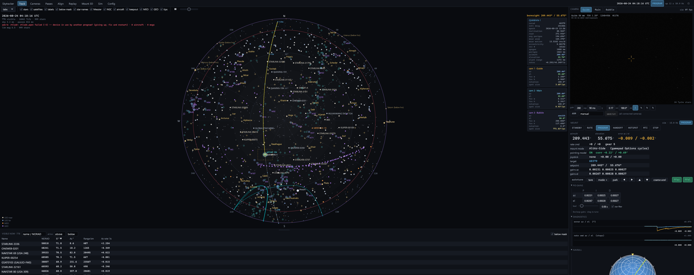

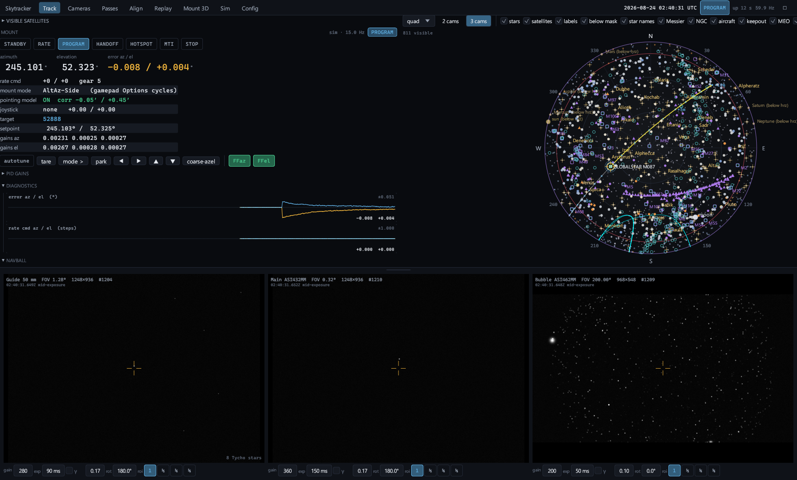

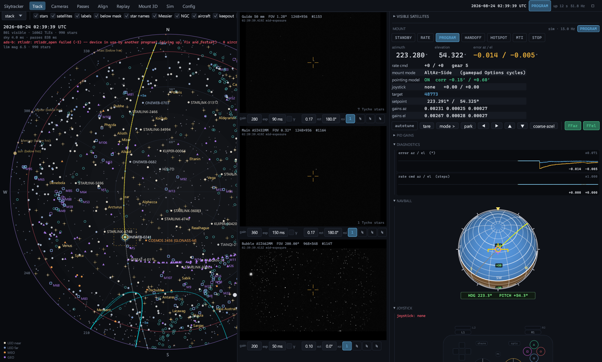

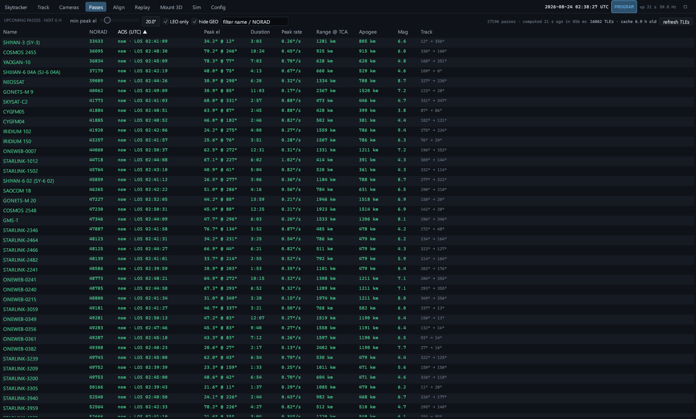

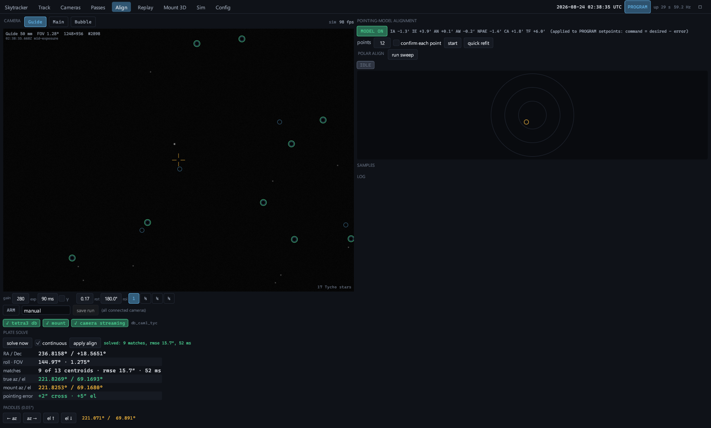

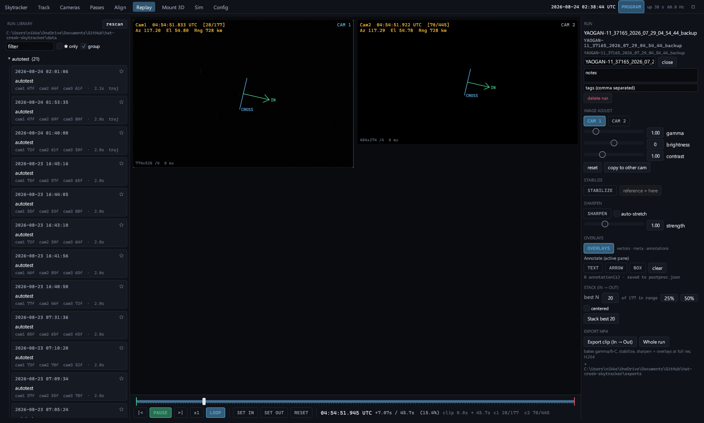

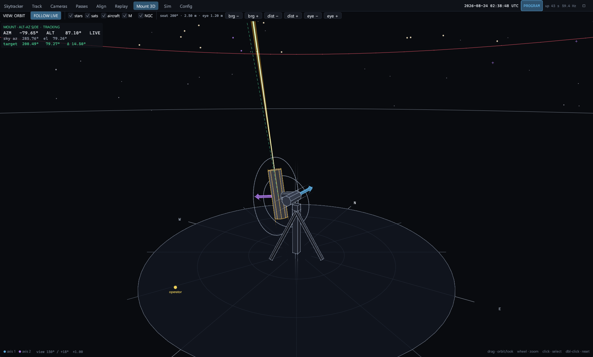

Cameras are logical slots (`camera_configs.camera1..3`: name, role, `asi_index`, pixel size,
focal length, sensor size, bin, projection pinhole/fisheye, gain/exposure/gamma/rotation,
tetra3 db); `hotspot_camera_index` / `plate_solve_camera_index` pick the slots the loop and
the solver use. The camera source is the Rust hardware simulator by default (Tycho-2 stars
to mag 10 + the live satellites projected through camera 1's pinhole at the
mount's *true* pointing, Gaussian PSFs + read noise, through the real
capture pump at ~100 FPS) or a ZWO ASI camera (`"camera_source": "asi"`);
the mount is the byte-level simulated NexStar responder or a serial port
(`"mount_transport": "serial"`, `"mount_serial_port": "COM3"`). In
HANDOFF/HOTSPOT the camera worker pushes frames straight into the core
loop's frame slot — the in-process optical feed. Run from anywhere (the
repo root is found from the cwd, `SKYTRACKER_ROOT`, or the build
checkout):

```
cargo run --release --manifest-path rust/Cargo.toml -p skytracker-app
```

TLEs: `tle_cache.tle` is refreshed from Celestrak (`tle_url`, default the active group)
when older than `tle_cache_age_hours` (12) or on **refresh TLEs** in Passes; the sky and
mount workers reload the catalog in place.

Phase 8 (Python retirement) inventory + rig checklist: [doc/PHASE8_READINESS.md](doc/PHASE8_READINESS.md).

Headless checks: `SKYTRACKER_AUTOTEST=<seconds>` injects a sim misalignment,
selects a LEO target, arms HANDOFF, captures a short run, plate-solves and
runs an 8-point alignment while logging the loop once a second;
`SKYTRACKER_SCREENSHOT_DIR=<dir>` tours every screen and saves PNGs;
`SKYTRACKER_REPLAY_TEST=<run-folder-substring>` plays a run headlessly and
logs displayed-vs-wanted frames (replay runs synced as OneDrive online-only
placeholders download on first playback — the transport says so).
`SKYTRACKER_VSYNC=0` / `"ui_vsync": false` unlocks the frame rate.
`SKYTRACKER_AUTOTEST_TARGET=body:sun|star:HIP32349|dso:M031|adsb:<icao>`
makes the autotest PROGRAM-track a celestial/aircraft target instead.
ADS-B: `"adsb_source_mode": "rtlsdr"` receives 1090 MHz natively through
`rtlsdr.dll` (2 MS/s, pyModeS-equivalent demodulator in `skytracker-adsb`),
`"dump1090"` reads a dump1090 SBS feed (`adsb_dump1090_host/port`), `"sim"`
(or `SKYTRACKER_ADSB=sim`) flies three simulated aircraft.

## Hardware Simulator

To hone the user experience and develop the control/acquisition algorithms
without the bulky hardware, the app includes software simulators for the mount
and both cameras. Enable it from the **HW Sim** screen (off by default — when
off, real-hardware behavior is unchanged):


- **Sim mount** integrates the same rate commands the control loop issues into a
  true pointing, and reports an encoder position with injectable **initial
  misalignment** and **noise** — so offset calibration and the closed loop have
  something real to fight.
- **Sim cameras** render synthetic imagery of whatever is being tracked, given
  the mount's true pointing and the camera geometry, with injectable
  **inter-camera rotation + image-plane misalignment** (what co-boresight
  calibration is meant to solve). Frames flow through the *same* capture pipeline
  the real cameras use.
- A **launch** renders as a hot plume; a **live-TLE satellite** renders as a small
  dot in the wide cam and a rough **Starlink V2 Mini** in the narrow cam, over a
  **star field that streaks** with mount motion.

| Wide / guide cam (satellite dot among streaking stars) | Narrow cam (Starlink V2 Mini) | Launch plume |
| --- | --- | --- |
|  |  |  |

The simulator closes the loop entirely in software: sim mount pointing → sim
camera render → hot-spot detection → PID → rate command → sim mount moves. This
makes it possible to demonstrate a full hand-off-and-track sequence at a desk.

## Configuration

Site, optics, PID gains, safety limits, hot-spot, and simulator parameters live
in `config.json` and are editable from the **Config Options** and **HW Sim**
screens.


## Testing

The control/detection/simulation logic is covered by headless unit tests,
including a sim-in-the-loop test that asserts the hot-spot loop drives a
simulated object to frame center. The whole suite runs under pytest:

```
pip install -r requirements.txt
pytest                                 # ~250 tests, headless, < 1 minute
```

Suites with missing prerequisites are skipped automatically with a reason
(see `conftest.py`): the Rust parity tests need the `skytracker_core` wheel
(`maturin build rust/skytracker-ffi`), the star-catalog tests need
`hip_main.dat` (CDS I/239) in the repo root, and plate-solve tests need
`tetra3`. `de421.bsp` is auto-provisioned from the `skyfield-data` package.
Individual files still run standalone, e.g. `python test_simulator.py`.

## Project Goals & Roadmap

The longer-term vision is one set of cooperating, automation-friendly tools that
make running an optical pass fun and fast — so even a child could run it — rather
than alt-tabbing between many GUI programs.

- **Visibility & pass setup** — rich, annotated live sky plots; extract relevant
  facts for a known opportunity; overlay optical-system capability; ingest a PVT
  ephemeris + covariance to augment TLE; annotate TLE-vs-ephemeris differences.
- **Sensor-to-mount calibration** — guided two-sensor co-boresight against a
  guide star; solve sensor rotations and step calibrations into config.
- **Joystick loop** — manual track, program track, moving-object search,
  acquisition, tracked-object handoff, click-in-image selection, and labeled
  capture (UTC, mount az/el, rate, centroid per frame).
- **Post-processing** — quick-look and product generation to get a good shot
  posted fast (largely implemented — see the Post Processing screen above). A
  PIPP-style prep stage (sharpness grading, "lucky" frame culling, target
  centring/cropping) feeds an AutoStakkert-style stacker that aligns and
  averages the best frames — optionally with alignment-point local warping —
  into one high-SNR master ready for wavelet sharpening.

We deliberately don't try to re-create everything existing tools (Heavens-Above,
SkyTrack, KStars, etc.) already do well — the focus is the niche capabilities
that go beyond them.

## License

See [LICENSE](LICENSE).
